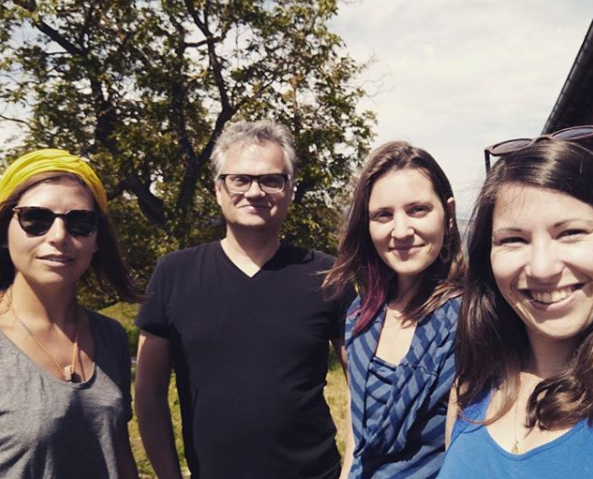
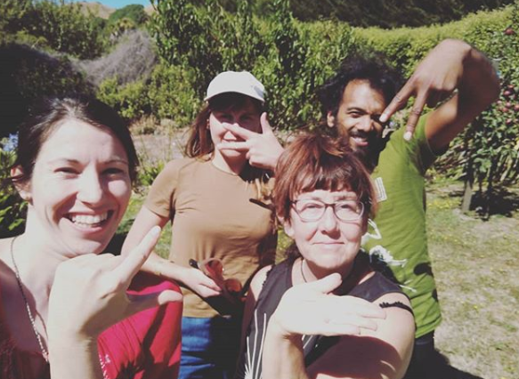

# History

The story of Greaterthan starts in November 2016 with Francesca Pick and Jessy-Kate Schlinger, who were both passionate about how **participatory budgeting** could transform power structures in their communities [Ouishare](http://ouishare.net) and the [Embassy Network](http://embassynetwork.com). In January 2017 they decided to meet in New Zealand at an [**Enspiral**](http://enspiral.com) gathering to work on [**Cobudget**,](https://app.gitbook.com/cobudget) a piece of participatory budgeting software prototyped and developed by various numbers in the network.

After one month of working together, Greaterthan was born as an umbrella project to drive forward the work on practices and tools for collaborative budgeting. **Greaterthan was then given stewardship of the Cobudget software** by Enspiral. From that starting point, a team of practitioners and developers, including **Kate Beecroft,** joined the project, spanning the globe from New Zealand to Europe.

In Summer 2018, the team was joined by two new founding partners, **Susan Basterfield** and **Anthony Cabraal,** to take Greaterthan into its next stage of evolution as a cooperative company.&#x20;

### Acknowledgements

We would like to acknowledge the contributions of those members that moved on to other projects, Jessy-Kate Schlinger, Juliana Lopker and Michael Arnoldus.&#x20;

...as well as those who brought Cobudget to life, Alanna Irving, Derek Razo, Eugene Lynch, Joshua Vial and Mickey Williams.

