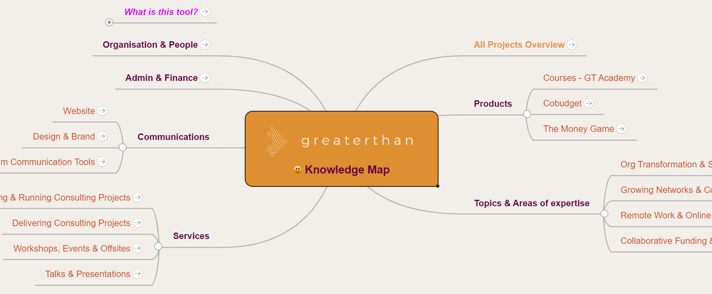

# 👥 How to use our CRM

## Why use a CRM?&#x20;

The reason we are using a CRM in the Greaterthan team is for all of us to:

* get an overview of who is/ was talking to which customer or partner and have all their information in one place
* track follow ups and other actions related to customers and partner organizations
* see in one glance the status of our deals pipeline&#x20;

## Getting started

The tool we are using is Airtable. [https://airtable.com/](https://airtable.com/tblmPDfREHtLlPH1f/viwFj1M692096Kq8E)

* To **join**, ask Francesca to send you an invite.&#x20;
* If you want, downlad the Airtable app to easily manage everything from your phone
* **Add & update your contacts, orgs and deals** from various channels

## CRM Structure&#x20;

1. **Opportunities:** this is the pipeline for all our "deals". Depending on the "View" you choose, you can see them filtered by different criteria, such as stage or product/service.
2. **Accounts**: the organizations we work with, including customers, affiliates and partners.
3. **Contacts:** the people we work with inside those organizations (listed in accounts)
4. **Interactions:** where we track our interactions with contacts, such as calls, meetings and emails.&#x20;

## How to make the most of our CRM

The most important about a CRM is that it is up to date :). Therefore let's try to use it as a tool for our reminders and personal tracking of where we are at with our deals and contracts, because then it will automatically be up to date.

### Usage Principles

* **The more information the better:** Fill out all the fields **** you have answers to when adding new fields
* **Tagging & comments:** Please add any relevant tags to organizations and contacts that will help us find them later. You can add as many as you like, and it makes sense to include comments about things such as: event where you met them, topic they are focused on (i.e. blockchain), more details on the org type (i.e. coworking space)
* Please make sure to always **attribute an opportunity to a contact and /or an organization.**&#x20;
* **Before you reach out to an organization in the future,** search the CRM before to check whether we are already in touch with them!

### Process Guidelines

**When you schedule / do a call / meeting with a customer or partner...**

...add a line in the "Interactions" tab, including the name of the contact, and will out the fields as you see fit. This way others will be able to look up easily what was the last interaction with that contact.&#x20;

**After your call/ meeting**

* add your meeting notes to the interaction in the "notes" field, either directly or as a link to a document.
* create a deal in the pipeline tab, if there is one.&#x20;

**When you create a deal...**

...associate it to one or all related contacts & the organization
