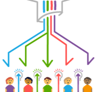
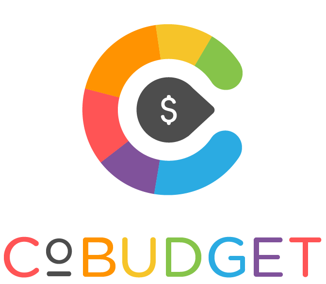

# Cobudget

**Cobudget is a practice and software tool for collaborative funding.** 

In 2017, Greaterthan took on the stewardship of the open source software tool [Cobudget](http://cobudget.co), which was originally developed by various members of the Enspiral network. Currently, our team is focusing on supporting groups with the _**practice of Cobudgeting**_ rather than doing technical development of the application, but we occasionally collaborate with development teams from our network. 

As an open source project, we are very open to working with developers interested in evolving or building on top of Cobudget, to the this concept to the next stage on the technical level. 

## Key Resources & Links

* [Basic guide to Cobudgeting](http://guide.cobudget.co)**:** features, case studies, templates & more
* [Overview of services ](https://cobudget.co/#/services?tab=buckets)we provide to help groups with collaborative funding
* **Practice Guide:** [5 steps to running a great collaborative funding round](https://guide.collaborativefunding.org/)
* [Cobudget terms of service](https://greaterthan.gitbook.io/cobudget/)

## Software Development 

* [Cobudget on Github](https://github.com/cobudget)
* [Public Roadmap](https://changemap.co/greaterthan/cobudget/)
* [Greaterthan Devops Handbook](https://devopsguide.greaterthan.works/)

The following pages explain how the Cobudget software team has been organized: 







